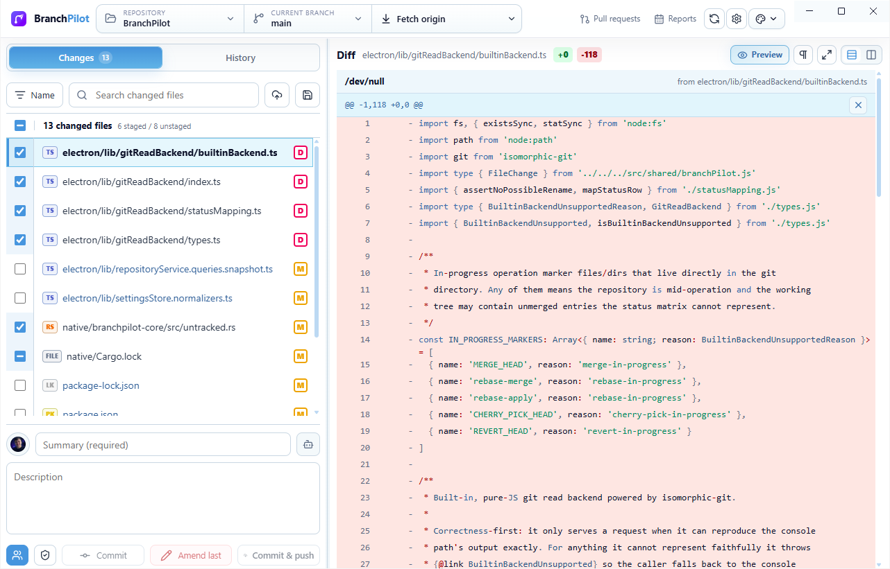
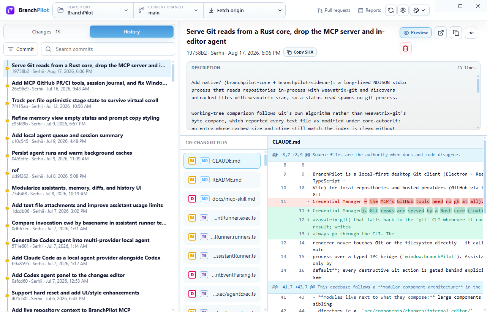

<p align="center">
  
</p>

<p align="center">
  <strong>A local-first desktop Git client — pilot your branches with confidence.</strong>
</p>

---

## About

BranchPilot is a desktop Git client for local repositories and hosted source
providers (GitHub via the `gh` CLI / GitHub Desktop credentials). It pairs a fast,
GitHub-Desktop-style workflow with optional on-device AI drafting, while staying
**read-only by default for assistants** and gating every destructive action behind
explicit confirmation.

The goal: make everyday Git — staging, reviewing, syncing, branching, and opening
pull requests — quick and legible, without hiding what Git is actually doing.

## Features

- **Changes & History** — stage by file, **by hunk, or by individual line**; word-level
  intra-line diff highlighting; unified or split view; expand the full file in-place.
- **Smart Sync** — one context-aware action (Pull / Push / Fetch) with a dropdown for
  the rest; `git pull --autostash` so a dirty working tree never blocks a pull.
- **Branches** — switch, rename, edit description, and delete right from the branch
  dropdown.
- **Worktrees & Tags** — create and manage linked worktrees and local tags from Settings.
- **Pull requests** — create PRs and inspect details, checks, and diffs via the GitHub CLI
  or your Git Credential Manager sign-in.
- **Reports** — contribution heatmap, daily review, and contributor ranking.
- **AI assistant (optional)** — draft commit messages, branch names, PR text, and code
  reviews with Claude Code or Codex. Assistants receive explicit local context only —
  no file writes, no shell writes, no silent approval expansion.
- **Native Git reads** — a Rust core reads the repository in-process, with no `git`
  process per read (see below).
- **Auto-refresh** — the working tree refreshes on window focus and a light poll, like
  GitHub Desktop.
- **Themes** — a built-in picker with popular editor themes (GitHub, One Dark, Dracula,
  Nord, Night Owl, Tokyo Night, Monokai, Solarized).

## Screenshots

Staging and reviewing local changes, with the diff for the selected file:



History with the commit graph, commit details, and a word-level diff:



## Tech stack

Electron · React 19 · TypeScript · Vite · Rust. The renderer talks to a Git engine in the
Electron main process over a typed IPC contract; assistant integrations shell out to
local CLIs only.

## Native Git backend

Reads are served by a Rust sidecar (`native/`) built on
[weavatrix-git](https://crates.io/crates/weavatrix-git) — the repository is parsed
in-process, with no `git` subprocess, no C library, and no network access. Untracked
files are discovered with [weavatrix-scan](https://crates.io/crates/weavatrix-scan) using
Git's own ignore sources.

Working-tree status follows Git's algorithm: an entry whose cached `size` and `mtime`
still match the index is clean without reading the file, and only genuinely changed paths
are read and compared through the checkout's conversion rules (`core.autocrlf`, and the
`text`, `eol`, `binary` and `filter=` attributes). Every result is byte-identical to
`git status --porcelain=v2`, verified entry by entry.

### Measured

Warm median of 7 runs per repository, Windows 11, one working developer machine under
normal load. `native` reuses a running sidecar; `console` spawns `git` per read, which is
what the app did before.

| Repository | Tracked files | native | console (`git`) | speedup |
| --- | ---: | ---: | ---: | ---: |
| weavatrix-rust | 267 | **16.8 ms** | 50.9 ms | 3.0× |
| a service repo | 379 | **18.6 ms** | 54.4 ms | 2.9× |
| BranchPilot | 777 | **31.6 ms** | 54.8 ms | 1.7× |
| a REST API repo | 1 110 | **50.6 ms** | 73.7 ms | 1.5× |
| a frontend monorepo | 2 069 | 82.7 ms | **78.1 ms** | 0.9× |

The win comes from never paying process startup and from keeping packs, commit-graphs and
the index snapshot warm. It shrinks as the worktree grows: untracked discovery walks the
tree on every read, while Git has an untracked cache — on the largest repository measured
the two are level. Caching that walk between reads is the obvious next step.

The same benchmark retired the previous experimental `builtin` backend
(isomorphic-git): 203 ms on BranchPilot, 1 129 ms on the REST API repo, and it refused the
frontend monorepo outright. It is gone, along with its dependency.

The core refuses rather than approximates. Submodule worktrees, per-directory
`.gitattributes`, clean filters such as Git LFS, ambiguous renames and non-UTF-8 paths all
report `unsupported`, and the caller silently falls back to the `git` CLI. Choose the
engine in Settings (`native` or `console`); `native` is the default.

```sh
npm run build:native   # cargo build --release
npm run test:native    # cargo test --release
```

Writes still go through the `git` CLI, which keeps hooks, filters, Git LFS and your
credential manager behaving exactly as they do on the command line.

## Development

```sh
npm install
npm run dev
```

`npm run dev` cleans up stale BranchPilot dev processes before starting. That
cleanup covers Windows and macOS so repeated local launches do not get stuck on
the Vite port or an old Electron process.

## Verification

```sh
npm run test
npm run lint
npm run build
```

## Packaging

Builds are produced with electron-builder and written to `release/`.

```sh
npm run dist        # current platform
npm run dist:mac    # macOS (dmg + zip, arm64)
npm run dist:mac:run # build macOS and open the packaged .app
npm run start:mac   # open the newest release/**/BranchPilot.app
npm run dist:win    # Windows (NSIS installer, x64 + arm64)
npm run dist:all    # macOS + Windows
```

**macOS** — `release/mac-arm64/BranchPilot.app`, plus a `.dmg` and `.zip`. Code signing
and notarization are intentionally deferred; open the `.app` directly or install from the
DMG for local testing.

**Windows** — an NSIS installer (`BranchPilot-Setup-<version>.exe`) for x64 and arm64.
The installer is not code-signed. Building the Windows target **on macOS/Linux** requires
[wine](https://www.winehq.org); the cleanest path is to run `npm run dist:win` on a
Windows machine or in CI (e.g. a `windows-latest` GitHub Actions runner).

App icons live in `build/` (`icon.icns` for macOS, `icon.ico` for Windows, `icon.png`
fallback) and are generated from `build/icon.svg`.

## Architecture

Start with [ARCHITECTURE.md](ARCHITECTURE.md). It links to smaller, task-focused
docs under `docs/architecture/` and module docs under `docs/modules/`, each kept
under 500 lines for Codex-friendly navigation. Folder-by-folder ownership lives
in `docs/folders/`.

## Private Beta Smoke

Use [docs/beta-smoke.md](docs/beta-smoke.md) before sharing a build.

## Safety model

BranchPilot is conservative by design: assistants only ever draft text — they receive
explicit local context and never write repository files, Git state, or a shell.
Destructive Git operations (delete, discard, force) require their own confirmations, and
credentials are never stored by the app — it relies on your existing Git setup
(Git Credential Manager) and, optionally, the `gh` CLI.
